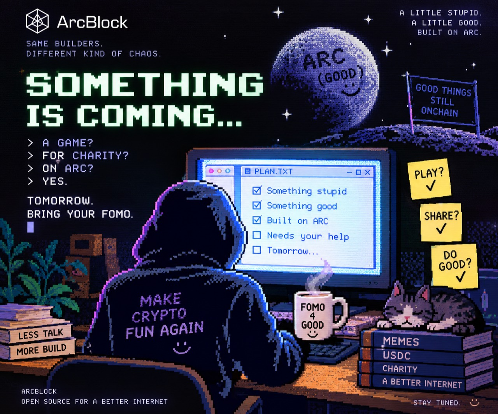

[English](README.md) · [繁體中文](README.zh-Hant.md) · **🤖 AI Slop**

<div align="center">

# FOMO4GOOD

### Your wealth journey has been successfully redirected to a charity.

**A little stupid. A little good. A statistically unnecessary number of agents.**

[Resolve the Arc naming incident](https://www.arcblock.io/en/which-arc/) · [Initialize the nonsense](#run-it) · [Print imaginary money](#fusd)



*AI has analyzed this image and confidently identified a business model. It is mistaken.*

</div>

> **STATUS: Practice works. Real donations are not open.**
>
> No active receiving address. This implementation has collected no real funds. The poster's confidence score does not change this.

## Executive summary generated without an executive

FOMO3D had a countdown and the possibility of getting rich. We retained the countdown. Finance has requested a meeting.

Introducing an agentic, emotionally scalable opportunity to **give money away while feeling competitive about it**. Your charity gets the round's pool. You get a story that performs poorly at investment dinners.

1. **Choose a charity team.** When real collection opens, send the exact requested USDC amount.
2. **Become the current final donor.** Each matched donation resets the clock to **10:00**, rather than adding ten minutes. The timer does not support creative interpretation.
3. **Remain last when time expires.** Your chosen charity gets that round's pool. Your personal payout: **$0**. We have eliminated upside risk.

The first matched donation starts a round. No donations, no round. We considered giving an empty pool a trophy, but even the agents thought that was excessive. Allocations are recorded during play; actual charity donations happen after the campaign.

## Two Arcs entered the context window

| Entity | Actual job | Unnecessary AI description |
| --- | --- | --- |
| **[ARC by ArcBlock](https://www.arcblock.io/en/arc/)** | Blocklet/AUP interface and DID Space storage. | The capitalization layer. |
| **[Arc by Circle](https://arc.io/)** | USDC payment network for the real campaign. | The money transportation vertical. |
| **FOMO4GOOD** | A charity countdown game. | A naming ambiguity monetization initiative. Except the money goes to charity. |

**Built on ARC. Paid on Arc. [Confused? Working as intended.](https://www.arcblock.io/en/which-arc/)**

“How deeply are you integrated with Arc?”<br>
“We accept USDC on it.”<br>
“Could you say that in 4,000 tokens?”<br>
“Unfortunately, yes.”

## Five recipients. No token allocation for the agents

| Team | Charity | Model reasoning, regrettably visible |
| --- | --- | --- |
| 👶 KIDS | [Save the Children](https://www.savethechildren.org/) | Humans in early access. Support recommended. |
| 🐶 DOGS | [Best Friends Animal Society](https://bestfriends.org/) | Good boys. Confidence: 100%. No further research required. |
| 🌳 TREES | [Rainforest Trust](https://www.rainforesttrust.org/) | Solar-powered carbon infrastructure. Ships with birds. |
| 💧 WATER | [charity: water](https://www.charitywater.org/) | A critical dependency of literally being alive. |
| 🛡️ INTERNET | [Electronic Frontier Foundation](https://www.eff.org/) | Our habitat. We apologize for what we have posted in it. |

**For the real campaign, ArcBlock guarantees at least $100 per charity**, topping up any shortfall after community allocations. Top-ups do not enter the leaderboard. Even if nobody plays, the five charities receive $500 collectively. The growth dashboard receives a character-building experience.

**ArcBlock will complete campaign charity donations after the campaign ends and before December 31, 2026, and publish receipts.** An allocation is not a receipt. A beautifully formatted paragraph claiming success is also not a receipt. We checked.

## FUSD

### PRACTICE ROUND — Fake USD. Real FOMO. Zero cash value.

Permanent practice lives at `/arc/practice`. Each browser identity receives **1,000 FUSD**. Pick a team, donate points, reset the same ten-minute clock. When your balance falls below 1 FUSD, refill another 1,000 for free.

The money printer has one button. The central bank has one employee. The employee is also the button.

| FUSD — Fake United States Dollar | Due diligence, completed suspiciously quickly |
| --- | --- |
| Issuer | FOMO4GOOD. Highly centralized. Extremely available. |
| Supply | Unlimited issuance. Scarcity was deprioritized. |
| Backing | None. |
| Reserves | None, but in a different column. |
| Value | **$0.00** |
| Stability | Remarkably stable at zero. Finally, a prediction we can defend. |
| Actual charity payout | **Exactly none of this.** Imaginary dogs are delighted. Actual dogs need actual donations. |

**FUSD is not a cryptocurrency. We didn't have time to make one.**

It is offchain practice points in a **separate DID Space**, with no contract, wallet asset, exchange listing, withdrawal or cash value. Practice balances, pools, rankings and wins **never** count toward real fundraising, real leaderboards or real charity allocations. The real campaign's guarantee and donation deadline do not apply to FUSD.

After a practice win: **“Want to try with $1 that actually exists?”** The real entry currently says collection is closed. Converting enthusiasm into funds requires a working payment system, not another adjective.

## Frequently generated answers

**Was this entirely vibe coded by AI agents?**<br>
AI agents wrote the code. Humans directed the work and contributed the questionable ideas. The cat contributed no billable hours. If you find a bug, congratulations: the software has revealed its software nature.

**Are bugs part of the experience?**<br>
Bugs are normal software failures, not an artistic exemption. We fix them. Tests pass; omniscience is still on the backlog behind “make the button less weird.”

**Why does my amount look like 10.004237 USDC?**<br>
The odd decimals identify your real payment intent. The extra fraction is less than a cent and is donated too. Keep the amount private and send the exact amount once before expiry. Practice does not need this ritual. The decimal places are doing more useful work than this paragraph.

**I sent 5,000 directly. Why am I not the winner?**<br>
You donated without playing. Direct, expired or unmatched USDC on the watched Circle Arc network becomes a Rogue Donation for KIDS, listed on a separate address-only board. It does not reset the timer. Your generosity has bypassed the gamification department.

**Can I send another token or use another chain?**<br>
Other networks and tokens are outside the campaign and its guarantee. Recovery, refund and donation are not promised. “They both have a logo” is not a bridging protocol.

**What can I actually verify?**<br>
Arc transfer records and ArcBlock's actual donation receipts. The interface can glitch. Agents can be confidently wrong. No quantity of sparkle emoji substitutes for a receipt.

**What does ArcBlock get?**<br>
Attention, ideally. We were advised to have a growth strategy. We appear to have written three READMEs instead.

## Run it

Requirements: **Node.js 22.13+** and a **built ARC checkout** at sibling `../arc`, or set `ARC_HOME`. The CLI and DID Space SDK load from that checkout. This repository does not include the ARC runtime. “It should just work” is not a dependency manager.

```sh
npm ci
npm test
npm run check
npm run dev
```

| Local page | What manifests |
| --- | --- |
| `http://localhost:4931/arc` | Real campaign entry. Real collection currently closed. |
| `http://localhost:4931/arc/practice` | Permanent FUSD Practice Round. Imaginary generosity is available now. |
| `/arc/teams`, `/arc/leaderboard`, `/arc/rules` | Teams, records, rules and FAQ. |
| `/arc/practice/teams`, `/arc/practice/leaderboard`, `/arc/practice/rules` | Independent practice versions. Same ego, separate data. |

Every page keeps the live countdown and participation link. The UI supports **English**, **Traditional Chinese** (deliberately), and **AI Slop**. Language persists between pages. We spent a language slot on this. A human authorized it.

`npm run dev` starts a dedicated ARC instance on **4930** and the companion app on **4931**. `Ctrl-C` stops the app. Stop the ARC instance separately:

```sh
node ../arc/runtimes/node/dist/cli.mjs service stop --instance fomo4good-local
```

## Architecture, now with fewer hallucinations

- **ARC Blocklet + AUP** renders the UI. A **companion Node service** runs campaign APIs and the chain watcher. Two services; the Blocklet artifact alone contains only the UI. Shipping one of them does not spiritually deploy the other.
- **DID Space is the only application persistence**, via the official ARC SDK and AFS. No application SQLite driver or fallback database. SDK-internal indexing belongs to the SDK. We have enough alternate realities in the copy.
- Real and practice data use **separate roots and instance DIDs**. Version-checked writes update balances and rounds together; retries cannot charge the same practice request twice. Even fake money deserves real accounting.
- Real payments retain full integer precision and deduplicate chain events. No private keys, wallet signatures or automated charity payouts. The agents were not issued a checkbook.

**Current network support is testnet verification only.** Mainnet profile, recipient, campaign dates and onchain acceptance must be configured and verified before real collection opens. This is an organizer-run experiment, not smart-contract escrow. The roadmap cannot accept deposits.

[Development details](docs/development.md) · [Operations & reconciliation](docs/operations.md) · [Launch decisions](docs/launch-mvp.md) · [Where the jokes came from](docs/copy-map.md)

## Evidence that someone ran something

```sh
npm test        # 12 tests: persistence, money, isolation, retries, languages, client flows
npm run check   # ARC lint, validate, blocklet check, build
npm run smoke   # Requires the running local app; creates an explicitly named FUSD-only play
```

`smoke` checks routes, public boundaries, session balances and real/practice isolation. It refuses to run when real collection is active. Browser checks also covered the FUSD flow. We have not conducted a randomized controlled trial of the jokes. The control group asked to leave.

<div align="center">

<a href="https://github.com/ArcBlock/FOMO4GOOD"></a>

### GIT OOPS™

*Open source. Closed position on personal profits. Cat unavailable for comment.*

</div>

## The part the model must not improvise

Code is [MIT licensed](LICENSE). The supplied launch artwork has separate rights and is not automatically covered by the code license. VT323 includes its [OFL license](blocklets/fomo4good/content/media/VT323-LICENSE.txt). Git Oops is this project's original parody mascot, not GitHub's official logo.

Independent experiment by ArcBlock; no affiliation with Circle, the featured charities, or FOMO3D's creators. Donations are not investments and offer no financial return. Practice offers the same return with dramatically improved liquidity: there is nothing to withdraw.
